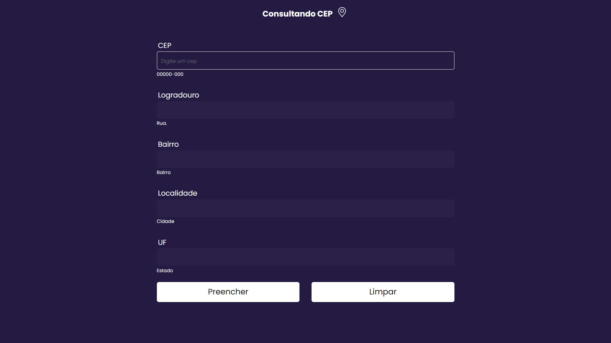

# ADRESS AUTOCOMPLETE
Este projeto foi realizado com o proposito de colocar em prática os conhecimentos nas seguintes tecnologias e linguagens:

* HTML
* CSS
* JAVASCRIPT

## :dart: Objetivo do projeto
Consultar uma API de CEP e através do retorno dos seus dados preencher dinamicamente os campos de endereço do formulário. Veja o layout base :point_down: e mais adiante a pagina para o resultado final

## :thumbsup: Resultado final
<h3>Quer ver :eyes: como ficou o resultado final? 
da uma olhada no link da página: :point_down:</h3>
<h3>:smirk::point_right: <a href="https://alvaronascimento-dev.github.io/adress-autocomplete/" target="_blank">Adress Autocomplete</a></h3>
